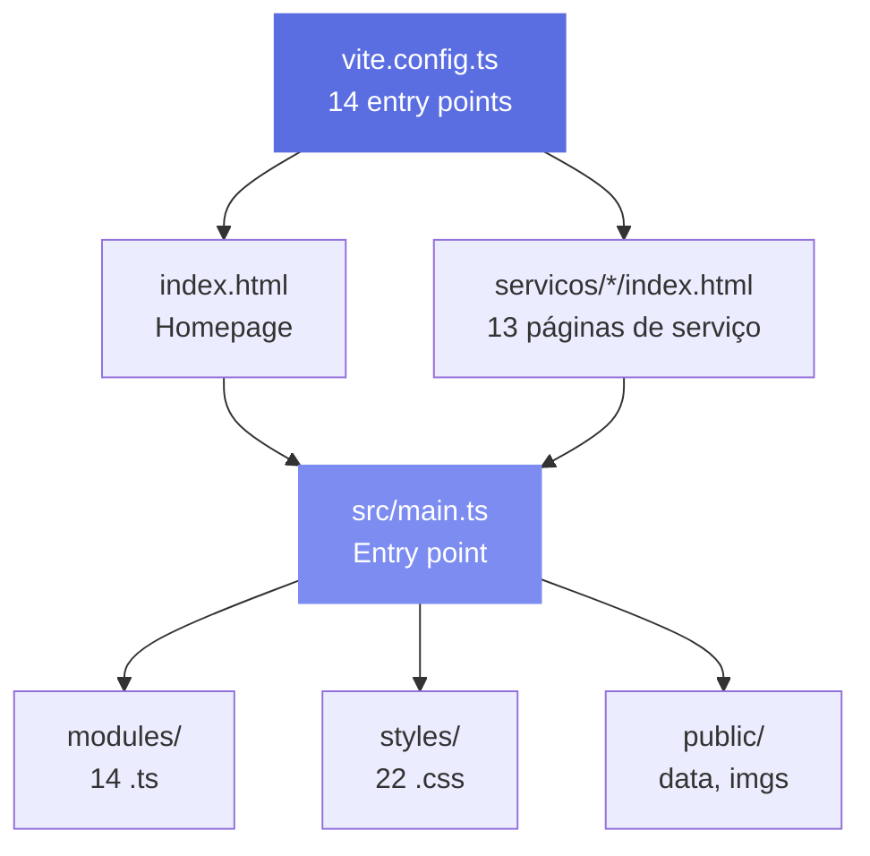
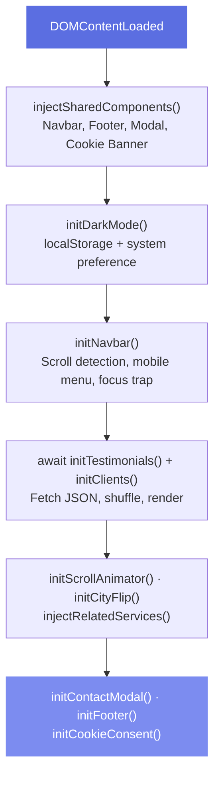

# Arquitetura

> Arquitetura Multi-Page Application com Vite, component injection pattern e theme system CSS-driven.

## Multi-Page Application (MPA)



## Roteamento baseado em arquivos

Cada página de serviço é um entry point independente no Vite:

```typescript
// vite.config.ts
build: {
  rollupOptions: {
    input: {
      main: resolve(__dirname, "index.html"),
      "poda": resolve(__dirname, "servicos/poda/index.html"),
      "corte-arvores": resolve(__dirname, "servicos/corte-arvores/index.html"),
      // ... 13 páginas de serviço
    }
  }
}
```

::: tip Benefícios do MPA
- Cada página carrega apenas o JS necessário
- SEO-friendly: HTML real servido pelo servidor
- Code splitting automático pelo Rollup
- Funciona sem JavaScript (progressive enhancement)
:::

## Fluxo de inicialização



::: warning Ordem importa
Componentes injetados primeiro, depois tema, depois interatividade. Inverter pode causar race conditions.
:::

## Estrutura de diretórios

```
arbo-sparkle-refresh/
|
+-- index.html                    # Homepage
+-- servicos/                     # 13 landing pages de serviço
|   +-- poda/index.html
|   +-- corte-arvores/index.html
|   +-- analise-risco/index.html
|   +-- laudos-tecnicos/index.html
|   +-- consultoria-ambiental/index.html
|   +-- licenciamento-ambiental/index.html
|   +-- plantios-compensatorios/index.html
|   +-- monitoramento-vegetacao/index.html
|   +-- cobertura-vegetal/index.html
|   +-- autorizacoes/index.html
|   +-- biologo/index.html
|   +-- art/index.html
|   +-- rt/index.html
|
+-- src/
|   +-- main.ts                   # Entry point único
|   +-- modules/                  # 14 módulos TypeScript
|   +-- styles/                   # 22 arquivos CSS modulares
|
+-- public/
|   +-- data/                     # JSON (clientes, depoimentos)
|   +-- images/                   # Assets estáticos
|   +-- robots.txt, sitemap.xml
|
+-- .github/workflows/static.yml # CI/CD
+-- vite.config.ts                # Build + MPA routing
+-- tsconfig.json                 # TypeScript strict mode
```

## Decisões arquiteturais

### 1. Component Injection Pattern

Em vez de usar um framework com componentes, o projeto injeta HTML via JavaScript:

```typescript
// shared-components.ts
export function injectSharedComponents() {
  // Injeta navbar no topo
  document.body.insertAdjacentHTML('afterbegin', renderNavbar());
  // Cria <main> wrapper
  // Injeta footer antes do fechamento do body
  // Injeta modal de contato
  // Injeta cookie consent
}
```

::: info Trade-off
Menos ergonômico que JSX, mas zero overhead de virtual DOM e zero dependências de framework.
:::

### 2. Data Layer via JSON

Dados dinâmicos (clientes, depoimentos) vivem em `public/data/*.json`:

- Fácil de atualizar sem tocar no código
- Versionado junto com o projeto
- Servido estaticamente com cache do CDN
- Randomização client-side para conteúdo fresco

### 3. API Integration Pattern

O módulo `cnpj-cep-service.ts` implementa:

- **Input masking**: Formatação automática de CNPJ/CEP
- **Rate limiting client-side**: 3 requests/min para proteger APIs públicas
- **Auto-fill**: Busca CNPJ preenche razão social, endereço, telefone
- **Error handling**: Mensagens específicas para cada tipo de falha

### 4. Theme System

Dark mode implementado com CSS Custom Properties:

```css
:root { --background: 40 20% 97%; }      /* Light */
.dark { --background: 40 18% 5%; }        /* Dark */
```

JavaScript apenas faz toggle da classe `.dark` no `<html>`. Toda a lógica visual é CSS-only.

## Configuração TypeScript

```json
{
  "compilerOptions": {
    "target": "ES2020",
    "module": "ESNext",
    "moduleResolution": "bundler",
    "strict": true,
    "noEmit": true,
    "paths": { "@/*": ["./src/*"] }
  }
}
```

- **strict: true** - Type checking completo
- **noEmit** - Vite transpila, TS só valida tipos
- **bundler resolution** - Otimizado para Vite
- **Path alias** - `@/modules/navbar` em vez de caminhos relativos
