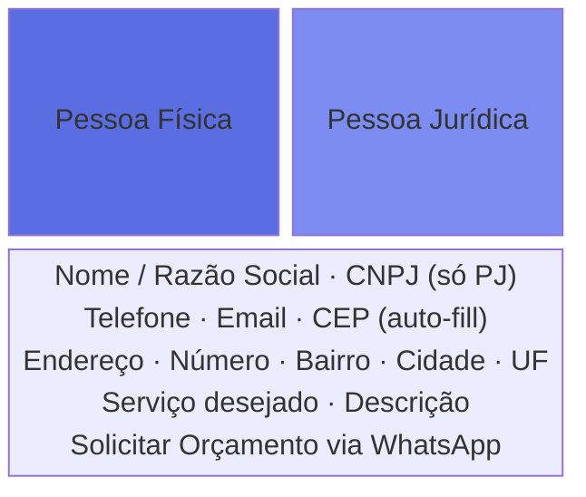

# Módulos TypeScript

> 14 módulos em `src/modules/`, totalizando ~1.175 linhas de TypeScript puro, sem dependências de framework.

```
src/modules/
+-- config.ts              [4 linhas]   Constantes globais
+-- shared-components.ts   [269 linhas] Injeção de componentes HTML
+-- navbar.ts              [65 linhas]  Navegação + acessibilidade
+-- contact-modal.ts       [289 linhas] Formulário PF/PJ + APIs
+-- cnpj-cep-service.ts    [85 linhas]  Masks, rate limit, API calls
+-- dark-mode.ts           [43 linhas]  Tema persistente
+-- scroll-animator.ts     [20 linhas]  Animações on-scroll
+-- testimonials.ts        [48 linhas]  Depoimentos randomizados
+-- clients.ts             [63 linhas]  Logos com variantes dark/light
+-- city-flip.ts           [73 linhas]  Carrossel de cidades
+-- related-services.ts    [154 linhas] Cross-linking entre serviços
+-- cookie-consent.ts      [19 linhas]  Banner LGPD
+-- footer.ts              [4 linhas]   Ano dinâmico
+-- toast.ts               [38 linhas]  Notificações transientes
```

---

## shared-components.ts - Component Injection

O módulo mais crítico. Gera HTML para componentes globais e injeta no DOM.

| Função | Responsabilidade |
|--------|-----------------|
| `renderNavbar()` | Header com links, tema, hamburger |
| `renderFooter()` | Footer com credenciais e navegação |
| `renderContactModal()` | Dialog com formulário completo PF/PJ |
| `renderCookieConsent()` | Banner de cookies LGPD |
| `injectSharedComponents()` | Orquestra injeção no DOM |

**Idempotência**: Cada injeção verifica se o elemento já existe antes de criar, permitindo override via HTML.

**Detecção de contexto**: `isHomePage()` gera `href` correto (relativo vs absoluto).

**Acessibilidade integrada**: `aria-label`, `aria-expanded`, `aria-selected`, `role="tablist"`, skip link.

---

## navbar.ts - Navegação Responsiva

### Funcionalidades

1. **Scroll Detection**: `.navbar--scrolled` quando `scrollY > 50`
2. **Mobile Menu**: Toggle do hamburger com troca de ícone (menu/X)
3. **Focus Trap**: Tab cycling dentro do menu mobile aberto
4. **Escape Key**: Fecha menu ao pressionar ESC
5. **Body Lock**: `menu-open` previne scroll do body

### Focus Trap (Acessibilidade)

```typescript
menu.addEventListener('keydown', (e) => {
  if (e.key === 'Tab') {
    const focusable = menu.querySelectorAll('a, button');
    const first = focusable[0];
    const last = focusable[focusable.length - 1];

    if (e.shiftKey && document.activeElement === first) {
      e.preventDefault();
      last.focus();
    } else if (!e.shiftKey && document.activeElement === last) {
      e.preventDefault();
      first.focus();
    }
  }
});
```

::: tip Acessibilidade
Usuários de teclado/screen reader não ficam "presos" fora do menu. Essencial para WCAG 2.1 compliance.
:::

---

## contact-modal.ts - Formulário Inteligente

O módulo mais complexo (289 linhas). Formulário de orçamento com:

### Sistema de Tabs PF/PJ



### Integrações API

**CNPJ Lookup** (publica.cnpj.ws):
- Dispara ao digitar 14 dígitos
- Rate limit: 3 requests/minuto
- Auto-preenche: razão social, endereço, telefone
- Feedback visual: indicador verde/vermelho

**CEP Lookup** (viacep.com.br):
- Dispara ao digitar 8 dígitos
- Auto-preenche: logradouro, bairro, cidade, UF

### Submissão via WhatsApp

```typescript
const message = `*Solicitação de Orçamento*
*ID*: #${quoteId}
*Tipo*: ${personType === 'pf' ? 'Pessoa Física' : 'Pessoa Jurídica'}
*Nome*: ${name}
*Serviço*: ${service}`;

window.open(`https://wa.me/${WHATSAPP_NUMBER}?text=${encodeURIComponent(message)}`);
```

### Dialog Management
- Elemento nativo `<dialog>` (semanticamente correto)
- Click fora fecha, Escape fecha
- Previne scroll do body quando aberto

---

## cnpj-cep-service.ts - Masks e API Layer

### Input Masking

```typescript
export function applyCnpjMask(value: string): string {
  return digits
    .replace(/^(\d{2})(\d)/, '$1.$2')
    .replace(/^(\d{2})\.(\d{3})(\d)/, '$1.$2.$3')
    .replace(/\.(\d{3})(\d)/, '.$1/$2')
    .replace(/(\d{4})(\d)/, '$1-$2');
}
// 12345678000190 -> 12.345.678/0001-90
```

### Rate Limiting

```typescript
const RATE_LIMIT = 3;
const RATE_WINDOW = 60_000; // 1 minuto
const timestamps: number[] = [];

function checkRateLimit(): boolean {
  const now = Date.now();
  while (timestamps.length && timestamps[0] < now - RATE_WINDOW) {
    timestamps.shift();
  }
  return timestamps.length < RATE_LIMIT;
}
```

::: warning Rate Limiting
APIs públicas brasileiras têm rate limits agressivos. Proteger no client evita bloqueio do IP e melhora a experiência do usuário.
:::

---

## dark-mode.ts - Theme System

### Hierarquia de preferência

```
1. localStorage('arbo_theme')    --> Escolha explícita do usuário
2. prefers-color-scheme: dark    --> Preferência do OS
3. Light mode                    --> Fallback padrão
```

### Implementação

```typescript
export function initDarkMode() {
  const stored = localStorage.getItem('arbo_theme');
  const prefersDark = matchMedia('(prefers-color-scheme: dark)').matches;

  if (stored === 'dark' || (!stored && prefersDark)) {
    document.documentElement.classList.add('dark');
  }

  // Reage a mudança do OS
  matchMedia('(prefers-color-scheme: dark)')
    .addEventListener('change', (e) => {
      if (!localStorage.getItem('arbo_theme')) {
        document.documentElement.classList.toggle('dark', e.matches);
      }
    });
}
```

**CSS-driven**: JS só adiciona/remove `.dark`. Todas as cores resolvidas por Custom Properties.

---

## scroll-animator.ts - Animações on-scroll

Apenas 20 linhas. Performance via IntersectionObserver:

```typescript
export function initScrollAnimator() {
  const observer = new IntersectionObserver((entries) => {
    entries.forEach(entry => {
      if (entry.isIntersecting) {
        const el = entry.target as HTMLElement;
        el.style.animationDelay = el.dataset.animDelay || '0ms';
        el.classList.add('anim-visible');
        observer.unobserve(el); // Single-fire
      }
    });
  }, { threshold: 0.1 });

  document.querySelectorAll('.anim-target').forEach(el => observer.observe(el));
}
```

::: info Padrão
JavaScript como trigger, CSS como motor de animação. Zero dependências de animation libraries.
:::

---

## testimonials.ts e clients.ts - Fetch + Shuffle

### Padrão compartilhado

```typescript
// Fisher-Yates shuffle
for (let i = data.length - 1; i > 0; i--) {
  const j = Math.floor(Math.random() * (i + 1));
  [data[i], data[j]] = [data[j], data[i]];
}
```

- Dados em JSON estático (`public/data/`)
- Shuffle client-side a cada visita
- Animação staggered (0, 100, 200, 300ms)
- `clients.ts` suporta logos light/dark mode com `loading="lazy"`

---

## related-services.ts - Cross-linking

### Service Map + Relationship Map

```typescript
const SERVICE_MAP = {
  'poda': { slug: 'poda', title: 'Poda de Árvores', icon: '...' },
  // ... 13 serviços
};

const RELATED: Record<string, string[]> = {
  'poda': ['corte-arvores', 'analise-risco', 'laudos-tecnicos', 'autorizacoes', 'art'],
  'corte-arvores': ['poda', 'analise-risco', 'autorizacoes', 'laudos-tecnicos', 'rt'],
  // ... cada serviço -> 5 relacionados
};
```

Detecta página atual via `window.location.pathname`, gera cards e injeta antes do `.contact-cta`.

**Impacto SEO**: Links internos distribuem autoridade entre páginas e reduzem bounce rate.

---

## Padrões recorrentes

| Padrão | Módulos | Descrição |
|--------|---------|-----------|
| **IntersectionObserver** | scroll-animator, city-flip | JS detecta visibilidade, CSS anima |
| **localStorage** | dark-mode, cookie-consent | Persistência leve entre sessões |
| **Fetch + Shuffle** | testimonials, clients | JSON estático, conteúdo fresco a cada visita |
| **Progressive Enhancement** | Todos | Site funciona sem JS, módulos são opcionais |
