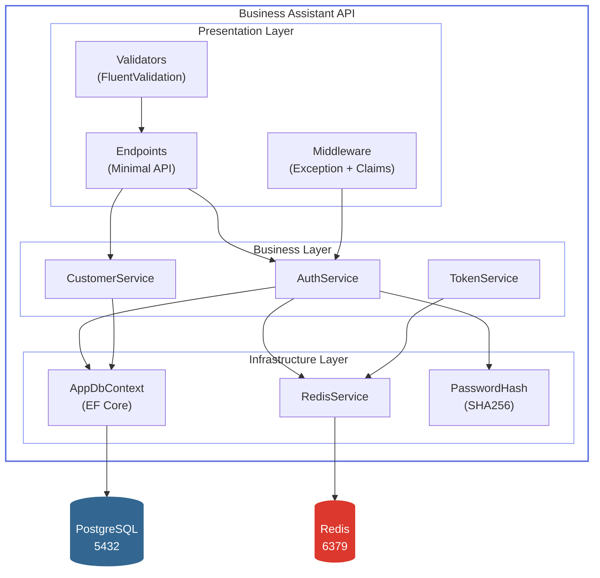
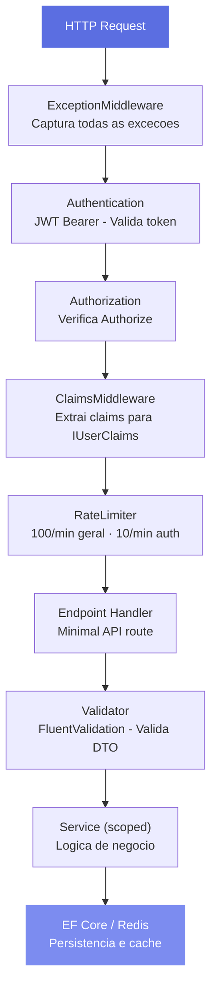

# Arquitetura

> Minimal API .NET 9 com arquitetura flat, custom configuration via extension methods e pipeline de middleware.

## Diagrama de componentes



## Fluxo de uma request



## Custom Configuration Pattern

::: tip Program.cs limpo
Cada concern e um extension method isolado. `Program.cs` tem apenas 27 linhas.
:::

```csharp
builder.Services
    .AddDatabaseConfiguration(builder.Configuration)
    .AddRedisConfiguration(builder.Configuration)
    .AddJwtAuthentication(builder.Configuration)
    .AddRateLimitConfiguration()
    .AddSwaggerConfiguration()
    .AddApplicationServices()
    .AddHttpContextAccessor();
```

| Extension Method | Responsabilidade |
|-----------------|-----------------|
| `AddDatabaseConfiguration` | EF Core + PostgreSQL + EnsureCreated |
| `AddRedisConfiguration` | IConnectionMultiplexer singleton |
| `AddJwtAuthentication` | JWT Bearer + validation params |
| `AddRateLimitConfiguration` | Fixed window policies |
| `AddSwaggerConfiguration` | OpenAPI + Bearer security |
| `AddApplicationServices` | Scoped services + validators |

## Estrutura de diretorios

```
src/BusinessAssistant.Api/
├── Configurations/             # 6 extension methods
│   ├── AuthenticationConfiguration.cs
│   ├── DatabaseConfiguration.cs
│   ├── DependencyInjectionConfiguration.cs
│   ├── RateLimitConfiguration.cs
│   ├── RedisConfiguration.cs
│   └── SwaggerConfiguration.cs
├── Data/
│   └── AppDbContext.cs         # 3 DbSets, Fluent API
├── DTOs/                       # Records imutaveis
├── Endpoints/
│   ├── AuthEndpoints.cs        # 4 rotas auth
│   └── CustomerEndpoints.cs    # 5 rotas CRUD
├── Exceptions/                 # Hierarquia customizada (8 classes)
├── Middleware/
│   ├── ExceptionMiddleware.cs  # Global exception handler
│   └── ClaimsMiddleware.cs     # JWT claims -> IUserClaims
├── Models/                     # Account, Password, Customer
├── Services/                   # 10 arquivos (interfaces + impls)
├── Validators/                 # FluentValidation
├── Program.cs                  # 27 linhas
└── Dockerfile                  # Multi-stage
```
