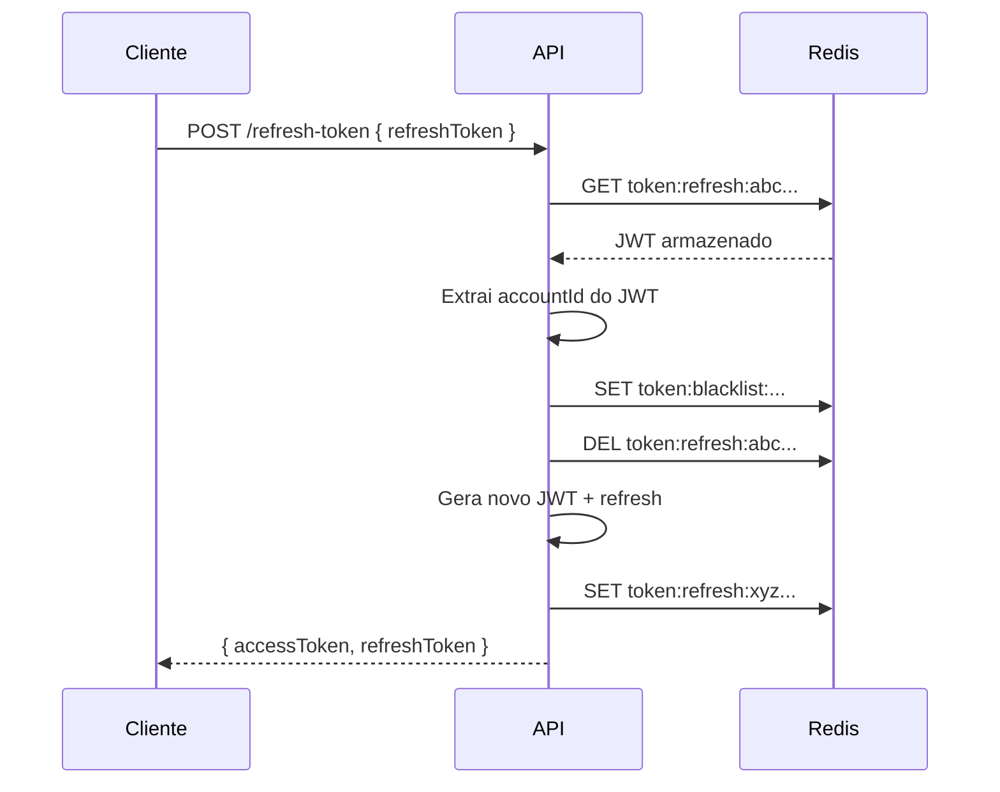

# Autenticacao e Seguranca

> JWT com refresh token rotation via Redis, hashing SHA256 com SaltObject, ClaimsMiddleware e rate limiting.

## Fluxo geral

```
1. SIGNUP ──> Cria Account + Password (SHA256 + salt) ──> Retorna JWT + RefreshToken
2. LOGIN  ──> Valida credenciais ──> Retorna JWT + RefreshToken
3. REFRESH ──> Redis lookup ──> Blacklista antigo ──> Novo par de tokens
4. LOGOUT ──> Blacklista access token no Redis (TTL 7 dias)
```

## Hashing de senha

### SHA256 com SaltObject

```csharp
public record SaltObject(Guid Id, Guid Salt);

public string Hash(string password, SaltObject saltObject)
{
    var input = $"{password}:{saltObject.Id}:{saltObject.Salt}";
    var bytes = SHA256.HashData(Encoding.UTF8.GetBytes(input));
    return Convert.ToHexStringLower(bytes);
}
```

```
Input:  "minhasenha:3fa85f64-...:7c9e6679-..."
                      ▲ Password.Id    ▲ Password.Salt
Output: "a1b2c3d4..."  (64 chars hex)
```

## JWT

```csharp
var claims = new[]
{
    new Claim("accountId", user.Id.ToString()),
    new Claim(ClaimTypes.Email, user.Email),
    new Claim(ClaimTypes.Name, user.Name),
    new Claim(ClaimTypes.Role, user.Role)
};
```

| Parametro | Valor |
|-----------|-------|
| Algoritmo | HmacSha256Signature |
| Access Token TTL | 1 hora |
| Refresh Token TTL | 24 horas |
| ClockSkew | Zero (expiracao precisa) |

## Refresh Token via Redis

### Armazenamento

| Chave Redis | Valor | TTL |
|-------------|-------|-----|
| `token:refresh:{refreshToken}` | JWT access token | 24h |
| `token:blacklist:{accountId}:{tokenPrefix}` | `"true"` | 7 dias |

### Fluxo de rotacao



::: info Redis direto
`IConnectionMultiplexer` direto (nao `IDistributedCache`) para controle total sobre operacoes Redis.
:::

## ClaimsMiddleware

Extrai claims do JWT automaticamente para um `IUserClaims` scoped:

```csharp
public class ClaimsMiddleware
{
    public async Task InvokeAsync(HttpContext context, IUserClaims userClaims)
    {
        if (context.User.Identity?.IsAuthenticated == true)
        {
            userClaims.AccountId = Guid.Parse(
                context.User.FindFirstValue("accountId"));
            userClaims.Name = context.User.FindFirstValue(ClaimTypes.Name);
            userClaims.Email = context.User.FindFirstValue(ClaimTypes.Email);
        }
        await _next(context);
    }
}
```

::: tip Beneficio
Endpoints acessam `IUserClaims` diretamente via DI, sem extracao manual de claims.
:::

## Rate Limiting

| Politica | Limite | Janela | Aplicacao |
|----------|--------|--------|-----------|
| `fixed` | 100 req | 1 min | Todos os endpoints |
| `auth` | 10 req | 1 min | Endpoints de autenticacao |

## Resumo de seguranca

| Aspecto | Implementacao |
|---------|--------------|
| **Senha** | SHA256 + UUID salt |
| **Tokens** | JWT (1h) + refresh (24h) no Redis |
| **Revogacao** | Blacklist com TTL 7 dias |
| **Rotacao** | Refresh gera novo par, revoga antigo |
| **Rate Limit** | Fixed window (100/min, 10/min auth) |
| **Soft Delete** | Clientes inativados, nunca deletados |
| **Claims** | Middleware centralizado |
