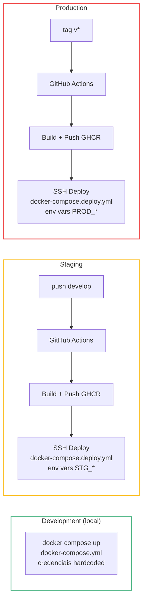

# Deploy e CI/CD

> Docker multi-stage, GitHub Actions com staging (develop) e production (tags v*) via GitHub Secrets.

## Ambientes



## Dockerfile (Multi-stage)

```dockerfile
# Stage 1: Build
FROM mcr.microsoft.com/dotnet/sdk:9.0 AS build
WORKDIR /src
COPY ["BusinessAssistant.Api.csproj", "."]
RUN dotnet restore
COPY . .
RUN dotnet publish -c Release -o /app/publish --no-restore

# Stage 2: Runtime
FROM mcr.microsoft.com/dotnet/aspnet:9.0 AS final
WORKDIR /app
COPY --from=build /app/publish .
ENV ASPNETCORE_URLS=http://+:8080
ENTRYPOINT ["dotnet", "BusinessAssistant.Api.dll"]
```

| Decisao | Justificativa |
|---------|---------------|
| Multi-stage | ~220MB (runtime) vs ~900MB (SDK) |
| COPY csproj primeiro | Cache do `dotnet restore` |
| Porta 8080 | Padrao para containers sem root |

## Docker Compose

### Desenvolvimento

```yaml
services:
  api:
    build: ./src/BusinessAssistant.Api
    ports: ["8080:8080"]
    depends_on:
      postgres: { condition: service_healthy }
      redis: { condition: service_healthy }

  postgres:
    image: postgres:16-alpine
    healthcheck: pg_isready -U postgres

  redis:
    image: redis:7-alpine
    healthcheck: redis-cli ping
```

### Deploy (Staging/Production)

```yaml
services:
  api:
    environment:
      - ConnectionStrings__DefaultConnection=${DB_CONNECTION_STRING}
      - ConnectionStrings__Redis=${REDIS_CONNECTION_STRING}
      - Jwt__PrivateKey=${JWT_PRIVATE_KEY}
    restart: always

  redis:
    command: redis-server --requirepass ${REDIS_PASSWORD}
    restart: always
```

::: warning Diferenca
Dev: credenciais hardcoded. Deploy: env vars via GitHub Secrets, Redis com senha, restart always.
:::

## GitHub Actions

### 3 Pipelines

| Pipeline | Trigger | Funcao |
|----------|---------|--------|
| **CI** | Push/PR em main e develop | Build + Test (PostgreSQL + Redis services) |
| **Staging** | Push em develop | Build image -> GHCR -> SSH deploy |
| **Production** | Tag `v*` | Build image -> GHCR -> SSH deploy |

### Fluxo staging

```
Checkout -> Login GHCR -> Build image -> Push image
                                            │
                                      staging-{sha}
                                      staging-latest
                                            │
                                            ▼
                                      SSH -> servidor
                                      export env vars (STG_*)
                                      docker compose up -d
```

### Secrets (por ambiente)

| Secret | Descricao |
|--------|-----------|
| `STG_SERVER_HOST` / `PROD_SERVER_HOST` | IP do servidor |
| `STG_SSH_PRIVATE_KEY` / `PROD_SSH_PRIVATE_KEY` | Chave SSH |
| `STG_DB_CONNECTION_STRING` / `PROD_DB_*` | PostgreSQL |
| `STG_REDIS_PASSWORD` / `PROD_REDIS_*` | Redis |
| `STG_JWT_PRIVATE_KEY` / `PROD_JWT_*` | JWT signing key |

## Fluxo de release

```bash
# Feature -> Staging
git checkout -b feature/nova-feature
git push origin feature/nova-feature
# PR -> merge em develop -> CI + deploy staging

# Staging -> Production
git checkout main
git merge develop
git tag v1.0.0
git push origin main --tags
# -> CI + deploy production
```
