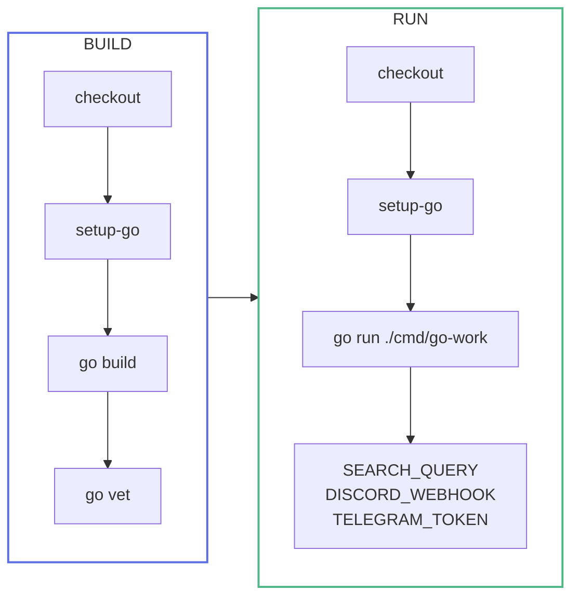
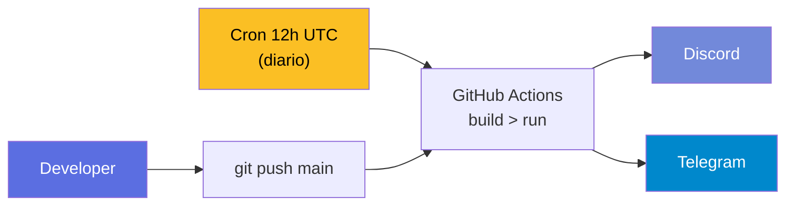

# Infra e Deploy

> Zero infraestrutura para manter. GitHub Actions cron + Docker multi-stage de 13MB.

## Ambientes

| Ambiente | Proposito | Infra |
|----------|-----------|-------|
| **Producao** | Cron diario | GitHub Actions (gratuito) |
| **Dev** | Testes com cache | Docker Compose (Redis + App) |

**Custo total: R$ 0**

## GitHub Actions — CI/CD + Cron

```yaml
name: Job Search Cron

on:
  schedule:
    - cron: "0 12 * * *"    # Diario as 9h BRT
  push:
    branches: [main]
  workflow_dispatch:
```

### Pipeline



::: tip Tres triggers
- **schedule** — Busca automatizada diaria
- **push** — Validacao + execucao pos-deploy
- **workflow_dispatch** — Testes sob demanda
:::

### Secrets

Todos os dados sensiveis em **GitHub Repository Secrets**:

```
SEARCH_QUERY          = golang,python,c#
SEARCH_MODELO         = remoto,hibrido
DISCORD_WEBHOOK_URL   = https://discord.com/api/webhooks/xxx
TELEGRAM_TOKEN        = 123456:ABC...
TELEGRAM_CHAT_ID      = -100123456789
```

## Docker — Multi-stage build

```dockerfile
# Stage 1: Build (~800MB)
FROM golang:1.25-alpine AS builder
WORKDIR /app
COPY go.mod go.sum ./
RUN go mod download
COPY . .
RUN CGO_ENABLED=0 go build -ldflags="-s -w" -o /go-work ./cmd/go-work

# Stage 2: Runtime (~13MB)
FROM alpine:3.21
RUN apk add --no-cache ca-certificates
COPY --from=builder /go-work /usr/local/bin/go-work
ENTRYPOINT ["go-work"]
```

| Flag | Efeito |
|------|--------|
| `CGO_ENABLED=0` | Binario 100% estatico |
| `-ldflags="-s -w"` | Remove debug info, ~40% menor |
| `alpine:3.21` | Imagem base de ~5MB |

::: info Resultado
Imagem de producao com **~13MB**.
:::

## Docker Compose

```yaml
services:
  redis:
    image: redis:7-alpine
    ports: ["6379:6379"]
    volumes: [redis-data:/data]

  go-work:
    build: .
    env_file: .env
    depends_on: [redis]
    environment:
      REDIS_URL: redis://redis:6379
```

## Fluxo completo



Sem servidor, sem monitoramento, sem custo.
