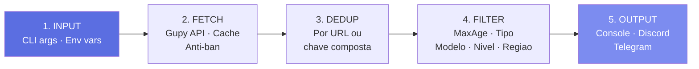
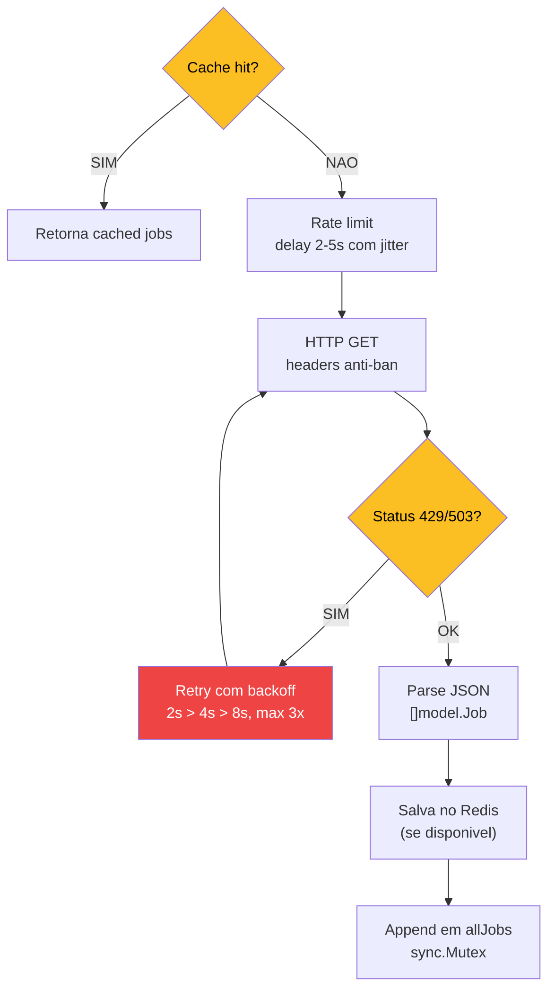
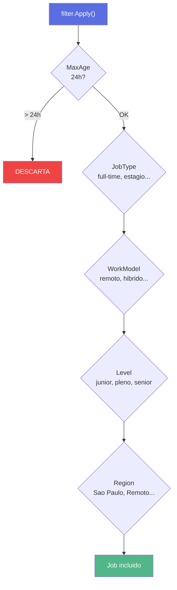

# Pipeline de Dados

> Do scraping a notificacao em 5 etapas lineares.

## Visao geral



## Etapa 1: Entrada

Prioridade de resolucao: `Flag CLI -> Variavel de ambiente -> Valor padrao`

```bash
# Flag CLI tem prioridade
./go-work -q "golang" -modelo "remoto"

# Sem flag, usa env var
export SEARCH_QUERY="golang"
./go-work
```

Multiplos termos separados por virgula: `"golang,python,c#"` -> 3 goroutines paralelas.

## Etapa 2: Fetch

### Fluxo por termo de busca (goroutine)



### Sistema anti-ban

| Camada | Implementacao | Objetivo |
|--------|---------------|----------|
| **UA Rotation** | 13 User-Agents reais | Evitar fingerprinting |
| **Headers Realistas** | Accept, Sec-Fetch-*, DNT | Simular navegador |
| **Rate Limiting** | Delay 2-5s com jitter | Nao sobrecarregar servidor |
| **Retry + Backoff** | 2s -> 4s -> 8s (max 3x) | Respeitar rate limits |
| **TLS 1.2+** | `MinVersion: tls.VersionTLS12` | Conexao segura |

::: warning Jitter
Requests com intervalos exatos sao facilmente identificaveis como bots. O delay aleatorio e crucial.
:::

## Etapa 3: Deduplicacao

```go
seen := make(map[string]bool)
var uniqueJobs []model.Job
for _, j := range allJobs {
    key := j.Key()  // URL ou titulo|empresa
    if !seen[key] {
        seen[key] = true
        uniqueJobs = append(uniqueJobs, j)
    }
}
```

Termos diferentes podem retornar a mesma vaga: "golang" e "backend" podem ambos retornar "Dev Backend Golang".

## Etapa 4: Filtragem



Filtros suportam multiplos valores: `-modelo "remoto,hibrido"` aceita **qualquer** um (OR logico).

## Etapa 5: Output

### Console

Tabela formatada com `text/tabwriter`:

```
FONTE   TITULO                    EMPRESA      LOCAL              URL
gupy    Dev Golang Senior         Empresa X    Sao Paulo, SP      https://...
gupy    Backend Developer         Empresa Y    Remoto             https://...
```

### Discord Webhook

```markdown
**Encontradas 5 vaga(s):**

**1. Desenvolvedor Golang Senior**
> Empresa: Empresa XYZ
> Local: Sao Paulo, SP
> Modelo: remoto
> [Ver vaga](https://empresa.gupy.io/jobs/12345)
```

Chunking automatico a cada ~1900 chars (limite: 2000).

### Telegram Bot API

MarkdownV2 com `escapeMarkdown()` tratando 18 caracteres especiais. Chunking a cada ~3800 chars (limite: 4096).
